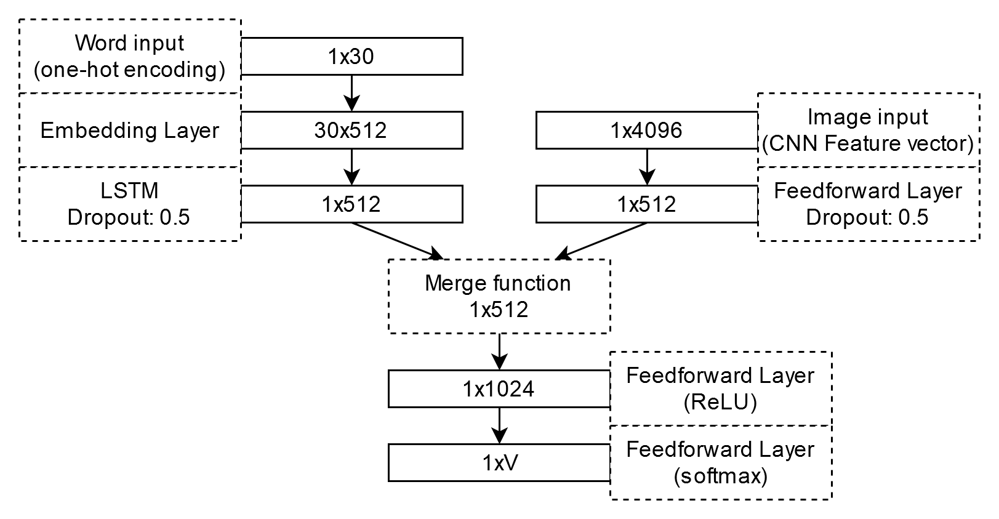

# Image Captioning Models
Source files for Image Captioning system for the use in my Bachelor thesis: _"Design and implementation of image caption generation system" (2022)_.
The model relies on RNN network for the sentence embedding and pretrained networks (like VGG19) for image embedding.

## Paper Summary 
A model for captioning images was constructed by merging the sentence and image representation and then calculating the propability of the most probable next token in the caption.

The Following merging methods were tested:
1. Simple Sum (A+B)
2. Multiplication (A*B)
3. Weighted Sum (A + (WA)*B)
Of which the weighted sum was the most proficient.

Captioning an image starts with feeding the model with image embedding and starting off with [START] token, the caption generation ends when model generates [END] token.

### Examples

